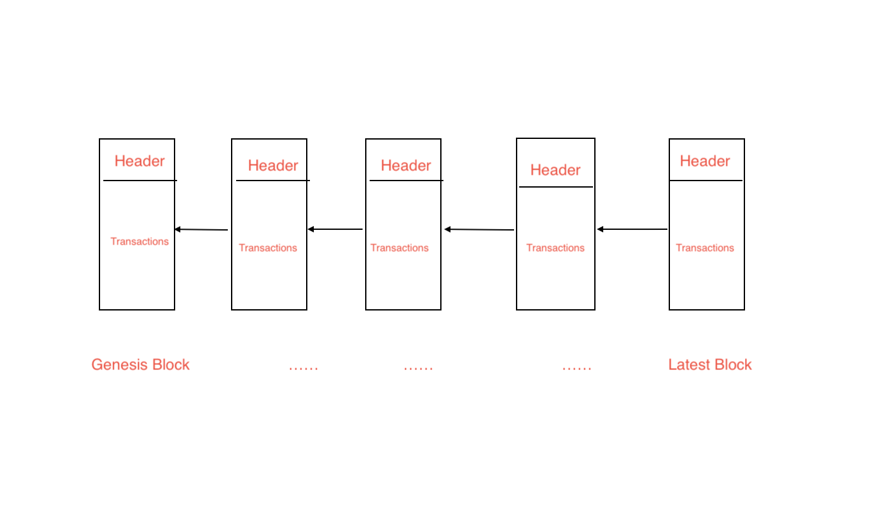

# 比特币中的数据结构  

## 哈希指针（Hash Pointers）  

对于一个结构体而言，指向它的指针存储的是它在内存中的首地址；而指向它的哈希指针，不仅保存这它的首地址，还保存着该结构体内容的哈希值。通过哈希指针，不仅可以找到该结构体，还能查验该结构内容是否被篡改过。  

## 区块链  

比特币中存储数据用的是区块链。所谓区块链，可以理解为链表。不过与链表不同的是，区块链使用哈希指针代替了普通指针。下图为区块链简单结构：  

  

> 哈希指针包含在该区块的区块头中，它是对前一个区块的整体进行哈希运算得到的。  

## Merkle tree