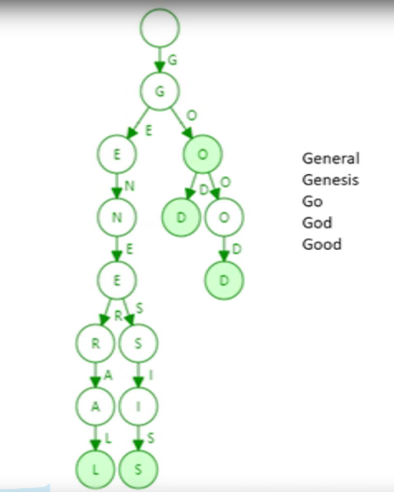
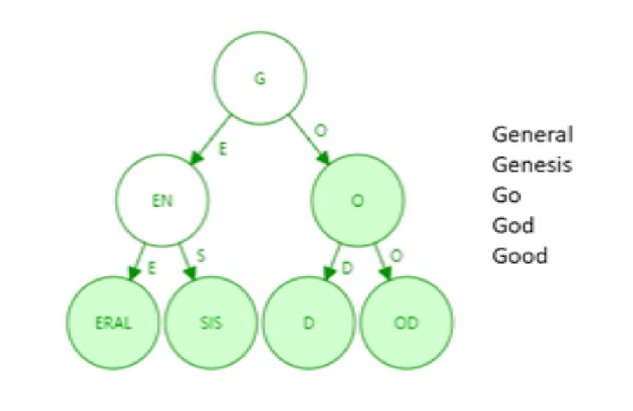

# 以太坊中的状态树  

以太坊是基于账户的账本，系统中会显式的记录每个账户的信息。  

## 账户地址到账户状态的映射  

以太坊中账户地址为160bit，即20个字节，一般用40个十六进制数表示。账户的状态，指的是外部账户和合约账户的状态：针对外部账户，包含余额和交易计数；合约账户还包括代码和存储。  

### 哈希表

用户账户与状态可以简单的看做是一个键值对，那么最直观的方式就是使用哈希表。当有新用户添加到系统中时，就在哈希表中添加一条新记录。  

在不考虑哈希碰撞的前提下，查找的时间是常数级，也很容易进行用户状态的更改。  

当双方进行交易时，需要像对方证明自己所有的以太币时，将系统中所有的账户信息组织成一个Merkle Tree，将根节点的哈希值保存在区块头中。要提交证明时，就可以使用Merkle Proof。当有新的区块发布时，哈希表中相关的账户信息就会改变，此时就需要重新构建Merkle Tree。但实际上每次区块发布时，有变化的账户都只是少部分的，大部分账户信息是没有改变的。  

按照以太坊每15s一个的出块速度，那意味着每15s就需要构建一次Merkle Tree，这样的代价是非常巨大的。  

那比特币为什么会用Merkle Tree呢？比特币中的Merkle Tree是用来组织区块中的交易的。在比特币中，每个区块中最多包含4000多笔交易，一旦出块，块中的交易是不会再发生改变的。所以在比特币中，一旦出块，Merkle Tree的根哈希值是不会改变的。  

Merkle Tree除了提供Merkle Proof，还用于保证全节点状态的一致性。

> 跟比特币一样，以太坊的区块中也是记录的交易。

### Merkle Tree  

那不用哈希表，直接使用Merkle Tree呢？Merkle Tree并没有提供一个高效的查找和更新的方案。而且，为了保证所有节点的一致性，那就必须进行排序。  

那比特币为什么没有这个问题？虽然在比特币系统中每个节点收到的交易顺序也不一样，但同一时间系统中只有一个节点可以出块，出块后，其它节点就放弃自己组装的候选区块，这就保证了Merkle Tree的统一。

### Sorted Merkle Tree  

那使用 Sorted Merkle Tree呢？当新增账户时，由于地址是随机的，所以插入Tree的位置也是随机的。插入之后，势必要进行重构，以太坊的用户规模来说，代价会很大。  

## MPT  

### Trie Tree  

Trie Tree又称字典树，前缀树。下图为5个单词组成的Trie Tree：  

  

Trie Tree特定：  

- trie中每个节点的分支数目取决于key值中每个元素的取值范围（上图中每个最多有26个分叉+一个结束标志位）。在以太坊中，每个地址使用40个十六进制的数表示，所以每个节点最多有17个分支：$0 ~ f$ + 一个结束标志位
- trie的查找效率取决于key的长度
- 哈希表存储在哈希碰撞，trie不会出现碰撞
- 给输入，最后生成的trie跟输入的顺序无关
- 局部更新性很好

缺点：  

- 存储开销大，很多节点只存储一个key，但其子节点只有一个。  

### Patricia Tree/Trie  

Patricia Trie就是进行了路径压缩的Trie Tree。下图是将上面的例子进行路径压缩后的结果：  

  

当有新的单词插入时，原本压缩的路径可能会被重新扩展开。树中插入的键值分布较为稀疏的情况下，路劲压缩的效果才最好。  

在以太坊中，160位的地址，取值范围有$2^{160}$种，跟账户数量相比，可以认为地址是非常疏松的。  

> 为什么要选用这么大范围的地址范围？跟比特币类似，用户的地址都是有用户自己创建，在账户发生交易前，系统是不知道用户的地址的。如果取值范围太小，就很容易发生碰撞，出现偷币的情况。足够大的地址可以减小碰撞发生的概率，从而避免偷币的发生。

虽然Patricia Tree可以用来管理以太坊的账户，但实际上以太坊使用的并非简单的Patricia Tree，而是Merkle Patricia Tree。

### Merkle Patricia Tree  

Merkle Tree与普通的Binary Tree不同点在于，Merkle Tree使用哈希指针代替了普通的指针，从而可以计算出一个根哈希值。根哈希值可用于：  

- 防篡改
- 提供Merkle Proof，供轻节点验证
- 证明某个产生交易的用户是否存在

以太坊针对MPT进行了修改，也被称为**MPT（Modified Patricia Tree）**。  

